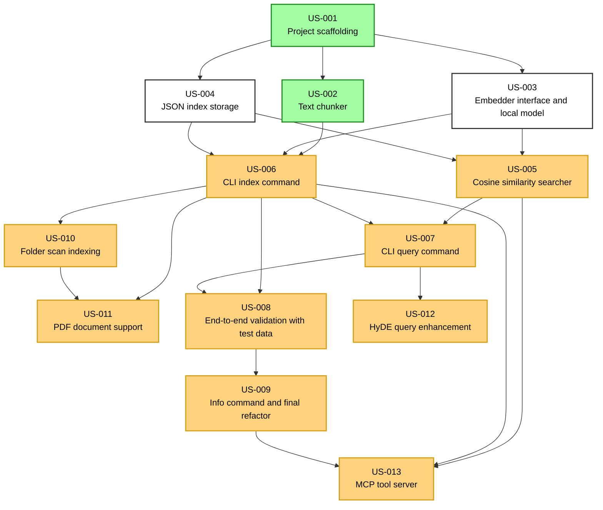

# 📋 Project Backlog

### ✅ Done
| ID | Title | Status | Type | Deps |
| :--- | :--- | :--- | :--- | :--- |
| US-002 | [Text chunker](stories/US-002-chunker.md) | `done` | feature | US-001 |
| US-001 | [Project scaffolding](stories/US-001-project-scaffolding.md) | `done` | tech-debt | - |

### 🚀 Workable (Ready to start)
| ID | Title | Status | Type | Deps |
| :--- | :--- | :--- | :--- | :--- |
| US-003 | [Embedder interface and local model](stories/US-003-embedder.md) | `todo` | feature | US-001 |
| US-004 | [JSON index storage](stories/US-004-storage.md) | `todo` | feature | US-001 |

### ⛓️ Needs Dependencies (Blocked)
| ID | Title | Status | Type | Deps |
| :--- | :--- | :--- | :--- | :--- |
| US-005 | [Cosine similarity searcher](stories/US-005-searcher.md) | `todo` | feature | US-003, US-004 |
| US-013 | [MCP tool server](stories/US-013-mcp-server.md) | `todo` | evolution | US-005, US-006, US-009 |
| US-011 | [PDF document support](stories/US-011-pdf-support.md) | `todo` | evolution | US-006, US-010 |
| US-010 | [Folder scan indexing](stories/US-010-folder-scan.md) | `todo` | evolution | US-006 |
| US-009 | [Info command and final refactor](stories/US-009-info-command-and-refactor.md) | `todo` | tech-debt | US-008 |
| US-006 | [CLI index command](stories/US-006-index-command.md) | `todo` | feature | US-002, US-003, US-004 |
| US-007 | [CLI query command](stories/US-007-query-command.md) | `todo` | feature | US-005, US-006 |
| US-012 | [HyDE query enhancement](stories/US-012-hyde-query.md) | `todo` | evolution | US-007 |
| US-008 | [End-to-end validation with test data](stories/US-008-validation.md) | `todo` | feature | US-006, US-007 |

## 🗺️ Dependency Graph

---
*Auto-generated by stori tool*